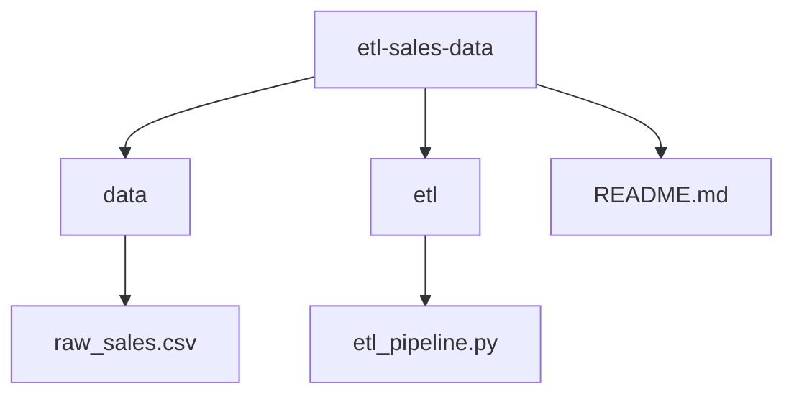

# 📊L Sales Data Project

This project demonstrates a simple **ETL (Extract, Transform, Load) pipeline** using Python and pandas.  
It is designed for practicing **data engineering workflows** and **Git collaboration**.

---

## 📂 Project Structure

---

## ⚙️ Features
- **Extract**: Loads raw sales data from `data/raw_sales.csv`
- **Transform**:
  - Clean column names (e.g., spaces → underscores, lowercase)
  - Handle missing values (e.g., missing prices)
  - Add derived fields (e.g., `total_sales = quantity * price`)
- **Load**: Saves the cleaned dataset into a new CSV file (`data/clean_sales.csv`)

---

## 🚀 Getting Started

### 1. Clone the Repository
```bash
git clone https://github.com/DevMuzee/etl-sales-data.git
cd etl-sales-data
```

