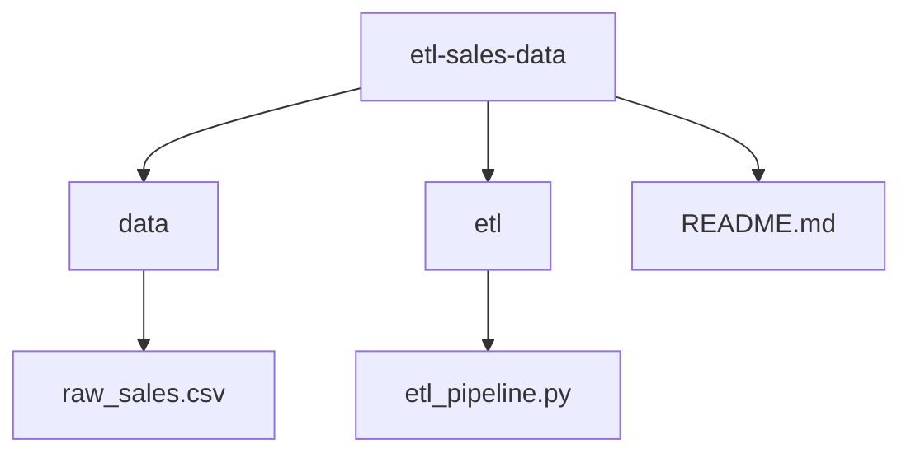
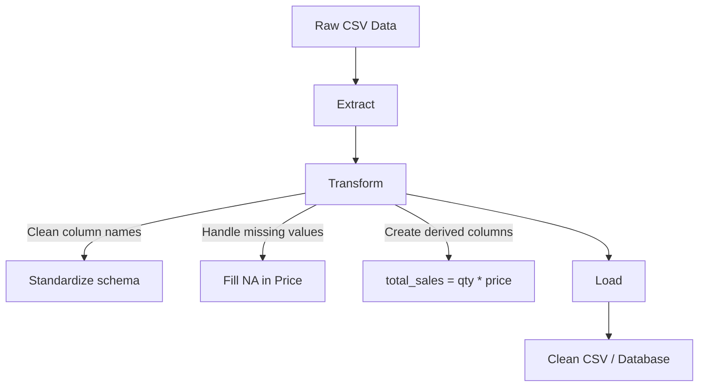

# 📊L Sales Data Project

A hands-on project demonstrating a complete **ETL (Extract, Transform, Load) pipeline** for sales data using **Python** and **pandas**.  
The repository is designed for practicing **data engineering workflows**, **Git collaboration**, and **real-world data cleaning tasks**.

---

## 🎯 Project Objectives
- Build a reproducible ETL pipeline for messy sales data.  
- Practice using **Git and GitHub** for collaborative workflows (branching, merging, resolving conflicts).  
- Showcase data engineering skills with professional project documentation. 

---


## 📂 Project Structure

---

## ⚙️ Tools & Technologies
- **Python 3** → programming language for ETL logic  
- **pandas** → data manipulation and cleaning  
- **CSV** → raw data source and output format  
- **Git** → version control system for collaboration  
- **GitHub** → remote repository for hosting and teamwork  

---

## 🛠️ ETL Workflow

### 1. Extract
- Load raw sales data from `data/raw_sales.csv`.  
- The dataset includes fields such as:
  - Transaction ID  
  - Date  
  - Product & Category  
  - Quantity & Price (with missing values)  
  - Customer ID  
  - Region  

### 2. Transform
- Standardize column names (lowercase, underscores instead of spaces).  
- Handle missing values:
  - Replace missing `Price` values with `mean of the total value`.  
- Add derived fields:
  - `total_sales = quantity * price`  
- Ensure clean, consistent output ready for analysis.  

### 3. Load
- Save the cleaned dataset as `data/clean_sales.csv`.  
- Future extension: load into **SQLite** or **PostgreSQL** for analytics.  

---

## 🚀 Getting Started

### Prerequisites
- Python 3.8 or later  
- Git installed  
- `pandas` library installed  

### 1. Clone the Repository
```bash
git clone https://github.com/DevMuzee/etl-sales-data.git
cd etl-sales-data
```
---

### ETL Flow (Mermaid Diagram)


---

### 📌 Future Enhancements

- Add unit tests for transformations
- Load cleaned data into SQLite/PostgreSQL
- Schedule pipeline runs using Apache Airflow or Prefect
- Extend project with data visualization (Matplotlib/Seaborn)
- Integrate CI/CD pipelines for automated testing

---

### 📜 License

This project is for educational purposes only.
The dataset provided is synthetic and does not represent real sales data.

---

###🙌 Acknowledgements

Inspired by real-world data engineering pipelines
Designed as a learning project for Git collaboration and ETL practice

---
